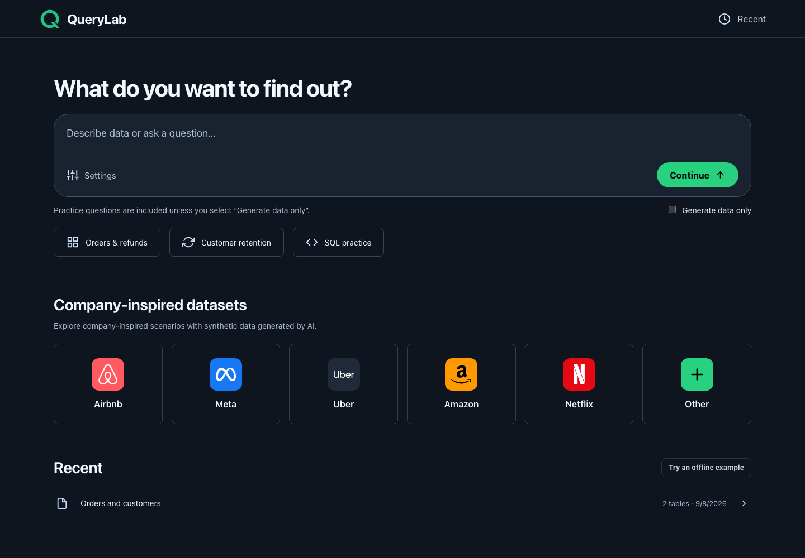
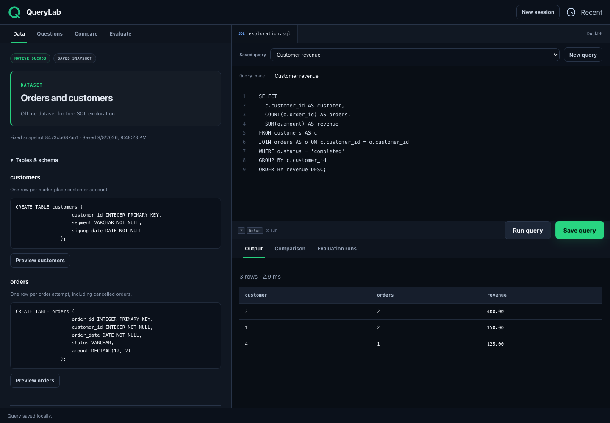

# QueryLab

[](https://github.com/mikeh-studio/querylab/actions/workflows/ci.yml)
[](LICENSE)

Generate sample datasets, explore them with SQL, and test query results against a reviewed reference. QueryLab runs locally with a browser workspace, DuckDB, and optional AI generation through Codex or Claude CLI.



## Get started

Requires Python 3.12 or newer.

```bash
git clone https://github.com/mikeh-studio/querylab.git
cd querylab
python3.12 -m venv .venv
source .venv/bin/activate
python -m pip install -e .
querylab --web
```

The app opens at `http://127.0.0.1:8765`. Choose **Try an offline example** to explore data and run SQL without an AI provider or API key.

For generated datasets, install and authenticate Codex CLI or Claude CLI, then choose the provider in **Settings**. Direct API providers are not implemented yet.

## How it works

1. **Describe your data or question.** Start with your own prompt or a company-inspired scenario. Practice questions are included by default; select **Generate data only** to skip them.
2. **Review and generate.** Check the scope before creating the dataset. Generated schemas and rows are validated before use.
3. **Explore and save.** Inspect tables, run SQL, and save named queries. Reopen the same dataset through **Recent** without regenerating it.
4. **Compare or evaluate.** Compare saved queries with each other, or test them against a reference query you have reviewed.

Company scenarios use synthetic data generated by AI. They do not contain real company records. QueryLab is independent and is not endorsed by the companies shown.

## Run real SQL



The screenshot uses the built-in synthetic dataset and an actual DuckDB query result. No live AI generation is needed for this example.

| Tool | What it does |
| --- | --- |
| **Data** | Inspect schemas, preview rows, and run SQL against a fixed dataset. |
| **Questions** | Work through generated prompts or add your own questions. |
| **Compare** | Run two to six saved queries and compare their results with the first selected query. Agreement does not establish correctness. |
| **Evaluate** | Save a reviewed reference and one to four datasets, then record pass/fail results for selected queries. |

Evaluation compares columns and values, including duplicates, NULLs, ordering, and numeric tolerance. AI does not decide whether a query passes. Passing a finite set of datasets is evidence for those cases, not proof that a query is correct for every input.

## Local by design

Datasets and saved SQL stay on disk. AI generation sends the requested context to the configured provider. The app has no authentication and should remain bound to `127.0.0.1`.

Exploration runs one read-only `SELECT` at a time with external file access disabled. Each operation has a five-second timeout and a 256 MB DuckDB memory limit. Results over 500 rows are rejected; use aggregation or `LIMIT`.

The exploration workspace uses native DuckDB. The separate interview interface at `/practice` also supports warehouse-dialect emulation through SQLGlot; it does not reproduce every warehouse feature.

See the [user guide](docs/user-guide.md) for provider configuration, storage, terminal commands, and interview practice, and [security guidance](SECURITY.md) before sharing an instance.

## Development

```bash
python -m pip install -e '.[dev]'
ruff check .
pytest
python -m playwright install chromium
pytest e2e -q --no-cov
```

Tests cover generation contracts, SQL execution, comparison, evaluation, persistence, and browser flows. Provider responses are controlled in tests; the browser suite does not call a live AI provider.

The code lives in `src/querylab`: `experiments` handles saved datasets and evaluation, `grading` compares results, `llm` wraps local providers, and `web` serves the UI and API.

## Next

Planned work includes file uploads, direct AI API connections, and external data sources. These are not available in the current app. See the [roadmap](docs/roadmap.md).
