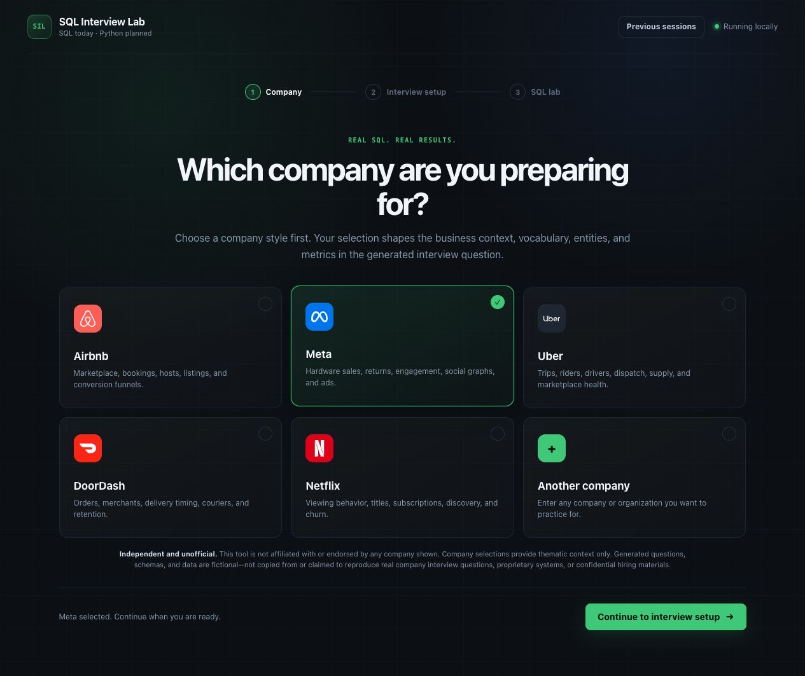
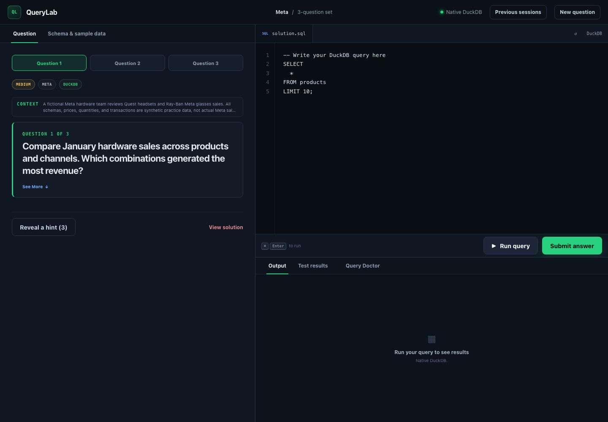

# QueryLab

[](https://github.com/mikeh-studio/sql-interview-lab/actions/workflows/ci.yml)
[](LICENSE)

QueryLab is a local SQL experimentation workspace with browser and terminal
interfaces. Its current workflow generates practice datasets and exercises, runs SQL,
and evaluates results against visible and hidden datasets. LLMs create exercises; DuckDB execution and deterministic comparison
decide
whether an answer is correct.

The current SQL experience includes:

- offline static practice or structured three-question generation
- Codex CLI by default, with Claude CLI as an interchangeable local provider
- strict Pydantic validation before any generated exercise runs
- native DuckDB execution and clearly labeled warehouse-dialect emulation
- fresh databases plus visible and hidden grading datasets
- deterministic comparison of columns, rows, duplicates, NULLs, ordering, and numeric tolerance
- dataset-, company-, or question-based starts in one SQL workspace
- Standard and Advanced interview modes, including debugging and analytical-case practice
- Query Doctor coaching only after execution and grading
- resumable local history with append-only submissions

QueryLab is independent and unofficial; it is not affiliated with or endorsed by
any company named in the app. Company selections describe fictional interview-style
approximations. Generated questions, schemas, and data are fictional: they are not copied from
or claimed to reproduce real company interview questions, proprietary systems, or confidential
hiring materials.

## Screenshots

### Company-first setup



### SQL workspace

The Meta demo progresses from hardware sales to return rates and net revenue, using
fictional Quest and Ray-Ban Meta transactions. It runs offline with no LLM required.



## Why execution, not LLM grading

An LLM is useful for creating business context, schemas, sample data, questions, hints,
and explanations. It is not the source of truth for correctness.

```text
LLM provider
  -> validated exercise JSON
  -> shared DDL + visible/hidden seed data + 3 questions and reference queries

user SQL -----------------------> fresh DuckDB -> actual result
reference SQL -> separate fresh DuckDB --------> expected result
                                                   |
actual result + expected result -> deterministic comparator -> pass/fail + diff
                                                   |
                                                   v
                                optional Query Doctor CLI explanation
```

The user's SQL never has to resemble the reference SQL. Different queries pass when they
produce the same columns and values under the exercise's ordering and tolerance rules.

## Architecture

```text
src/querylab/
├── cli.py                    # terminal UI and local web launcher
├── config.py                 # environment-backed provider configuration
├── models.py                 # strict exercise/request schemas
├── services.py               # shared generation + runtime validation
├── engines/
│   ├── base.py               # SQLEngine contract
│   ├── duckdb_engine.py      # native in-memory DuckDB backend
│   ├── emulated_duckdb.py    # strict SQLGlot-to-DuckDB translation
│   └── factory.py            # native/emulated backend selection
├── exercises/
│   └── static.py             # offline SQL exercise
├── generation/
│   ├── prompts.py            # structured generation contract
│   └── generator.py          # strict JSON parsing + Pydantic validation
├── grading/
│   ├── compare.py            # deterministic result comparison
│   └── grader.py             # isolated execution across all datasets
├── feedback/
│   └── query_doctor.py       # post-grade structured CLI coaching
├── history/
│   ├── base.py               # backend-neutral HistoryRepository contract
│   └── sqlite_repository.py  # local SQLite snapshots and submissions
├── llm/
    ├── base.py               # LLMProvider interface
    ├── command.py            # shell-free subprocess transport
    ├── codex_cli.py          # Codex structured-output adapter
    └── claude_cli.py         # Claude structured-output adapter
└── web/
    ├── app.py                # local FastAPI session/API boundary
    ├── sessions.py           # isolated in-memory practice sessions
    └── static/               # responsive HTML/CSS/JavaScript workspace
```

Generation, execution, grading, and presentation communicate through typed domain
objects. DuckDB is the native backend. Redshift, BigQuery, Snowflake, Databricks SQL,
and Presto use a separate, clearly labeled emulation backend that parses the selected
dialect with SQLGlot, translates supported SQL to DuckDB, and fails when SQLGlot reports
an unsupported translation. Emulation is useful for local practice, but it is not claimed
to reproduce every native warehouse semantic.

## Installation

Python 3.12 or newer is required.

```bash
cd /path/to/querylab
python3.12 -m venv .venv
source .venv/bin/activate
python -m pip install -e '.[dev]'
```

If needed, substitute another Python 3.12+ executable such as `python3.13`.

## Launch the browser interface

```bash
querylab --web
```

This starts a local server at `http://127.0.0.1:8765` and opens the interface. Use a
different port or keep the browser closed when needed:

```bash
querylab --web --port 9000 --no-open
```

If the lab is already running, the same command reopens it. If the executable is not found,
activate the project environment first:

```bash
source .venv/bin/activate
querylab --web
```

The former `sql-lab` and `data-interview-lab` commands remain compatibility aliases.
The Python package is now `querylab`; update imports from `sql_lab`.

The home page starts with **What do you want to find out?** Describe a dataset,
ask a business question, or request SQL practice in the same prompt. Example buttons
fill the composer; company tiles add an optional business context. The company
section states: “Explore company-inspired scenarios with synthetic data generated
by AI.” No real company records are supplied by these choices.

Use **Settings** for the generation provider. Practice questions are included
by default. Select **Generate data only** beneath the composer to skip questions.
**Continue** opens a scope review
before generation. The provider interprets your free-form prompt; inspect generated data
and questions before relying on them. All starts open the same native DuckDB
workspace with **Data**, **Questions**, **Compare**, and **Evaluate** tools.
Add your own questions, save named SQL, and return through **Recent**. Correctness
evaluation requires a separately reviewed reference.

Earlier interview sessions remain available through Recent sessions and retain their
original grading interface at `/practice`:

Standard Mode provides three SQL problems. Advanced Mode adds a focus area, SQL construction,
debugging, and an analytical case with a deterministically graded SQL deliverable. Its rubric is
for self-review only; it never overrides the database grader or assigns a hiring score.

Advanced Mode validates Question 1 and opens the lab while Questions 2 and 3 generate in
parallel. It can reuse a matching local dataset. Every run reseeds DuckDB; hidden data and
reference SQL stay server-side until **View solution** is explicitly confirmed.

## Local session history

Browser sessions are saved by default to:

```text
~/.querylab/history.db
```

Existing `~/.sql-interview-lab/history.db` and `~/.data-interview-lab/history.db`
files are reused in that order when the QueryLab history file does not exist.
No history is copied or moved.

Saved sets contain the validated exercise, latest SQL, pass/fail state, revealed hints, solution
state, and append-only submissions. They exclude routine run output, expected results,
credentials, and provider environment variables. The default retention limit is 200 sets.

The same private SQLite file stores a compact generation audit: stages, duration, CLI identity,
resolved model, cache use, and reported prompt/token counts. It excludes prompts, responses,
reference SQL, and generated rows. A separate local cache retains the 50 most recently used
shared datasets. **Clear all history** removes sessions, audit logs, and cached datasets.

Use **Save this session locally** to opt out. **Previous sessions** can resume, delete, or clear
saved work after a restart.

The path and retention limit are configurable:

```bash
export QUERYLAB_HISTORY_DB='/path/to/querylab-history.db'
export QUERYLAB_HISTORY_LIMIT=200
querylab --web
```

`QUERYLAB_*` variables take precedence; `SQL_LAB_*` and then `DATA_INTERVIEW_LAB_*` names remain supported
as compatibility fallbacks.

## Security and privacy

Keep the unauthenticated server on its default `127.0.0.1` address; do not expose it to an
untrusted network. Exercises and attempt history remain local and should not enter source
control. See [SECURITY.md](SECURITY.md) for full guidance.

## Run the offline exercise

No LLM tool, API key, or network access is needed:

```bash
querylab --static
```

Useful commands inside the shell:

| Command | Behavior |
| --- | --- |
| `.run` | Execute the current SQL buffer on the visible database |
| `.submit` | Grade the buffer on every fresh visible/hidden dataset |
| `.schema` | Show table descriptions and DDL |
| `.tables` | List tables |
| `.hint` | Reveal the next hint |
| `.solution` | Explicitly reveal the reference SQL |
| `.clear` | Clear the SQL buffer |
| `.reset` | Recreate the visible in-memory database |
| `.new` | Start another exercise |
| `.quit` | Exit |

Ending a SQL statement with `;` runs it immediately. `.submit` never compares SQL text
and does not reveal the reference SQL.

## Generate exercises with Codex CLI

Codex is the default provider. Follow the
[official Codex CLI instructions](https://learn.chatgpt.com/docs/codex/cli), sign in, and verify
the installation:

```bash
codex --version
```

Start an interactive generated session:

```bash
querylab
```

Or provide the setup non-interactively:

```bash
querylab \
  --llm codex \
  --company "Acme Health" \
  --dialect snowflake \
  --difficulty medium \
  --additional-context "Focus on subscription retention and patient engagement"
```

The adapter calls `codex exec` with stdin, `shell=False`, a read-only sandbox, and an Exercise
JSON Schema. It validates the response locally and reuses Codex CLI authentication, so no API
key is required.

The command prefix and timeout are configurable without changing application code:

```bash
export QUERYLAB_CODEX_COMMAND='codex exec --ephemeral --sandbox read-only --skip-git-repo-check --color never'
export QUERYLAB_LLM_TIMEOUT=600
export QUERYLAB_ADVANCED_LLM_TIMEOUT=1200
querylab --llm codex
```

Standard Mode defaults to 600 seconds. Each Advanced Mode call defaults to 1,200 seconds; the
remaining questions run concurrently after Question 1 passes validation.

Do not add the final prompt sentinel or `--output-schema` to
`QUERYLAB_CODEX_COMMAND`; the adapter supplies both.

## Optional Claude CLI provider

If the `claude` CLI is installed and authenticated locally, select it with:

```bash
claude --version
querylab --llm claude
```

Override its command prefix if needed:

```bash
export QUERYLAB_CLAUDE_COMMAND='claude --print --no-session-persistence --permission-mode dontAsk --tools ""'
```

The Claude adapter also uses stdin, `shell=False`, and native JSON Schema output.

## Optional API providers

API-backed providers are not implemented in this release; no API package or secret is needed.

## Dialect support

| Dialect | Model value | Execution status |
| --- | --- | --- |
| DuckDB | `duckdb` | Fully supported, native in-memory execution |
| Amazon Redshift | `redshift` | Emulated locally through SQLGlot and DuckDB |
| BigQuery (GoogleSQL) | `bigquery` | Emulated locally through SQLGlot and DuckDB |
| Snowflake | `snowflake` | Emulated locally through SQLGlot and DuckDB |
| Databricks SQL | `databricks` | Emulated locally through SQLGlot and DuckDB |
| Presto | `presto` | Emulated locally through SQLGlot and DuckDB |

The selected dialect applies to generation, parsing, and grading. The UI always labels native
versus emulated execution. Emulation excludes cloud-only services, external objects, UDFs, and
engine-specific behavior SQLGlot cannot translate faithfully.

## Tests

```bash
pytest
```

The unit and API suite enforces a 75% project coverage floor. Run the real-browser journey
after installing its Chromium runtime:

```bash
python -m playwright install chromium
pytest e2e -q --no-cov
```

The browser test starts the local server, loads the instant demo in Chromium, executes and
submits the reference query against visible and hidden datasets, and verifies saved history.
It does not call an LLM provider.

The suite covers deterministic grading, engine isolation, all emulated dialects, CLI failures,
structured generation, progressive loading, local history/cache behavior, and browser API flows.

## Roadmap

Saved datasets, free SQL exploration, query comparison and reviewed-reference
evaluation are available. Next:

1. Extend dataset generation controls.
2. Upload CSV/Parquet files and explore them in the same local workspace.
3. Add assertion-only evaluation cases.
4. Connect external data sources with read-only access and reproducible snapshots.

See [the development roadmap](docs/roadmap.md) for the proposed first slice.

## Saved datasets and free exploration

Use the home-page composer (`/explore` remains an alias). Describe
a dataset and generate it using a configured local provider, or try the offline example.
Inspect table definitions, preview rows, run SQL, and explicitly save named queries.
Reopening a saved experiment restores its materialized data, saved questions, and saved SQL without
regenerating data or requiring an interview question.

Experiments are stored in an `experiments/` directory beside the configured history
database. Clearing interview history does not delete experiments. Each dataset is a
fixed native DuckDB snapshot; query edits update metadata, not the snapshot. Python
imports for this feature live under `querylab.experiments`.

Exploration permits one read-only SELECT at a time, disables external file access,
and limits each database operation to five seconds and 256 MB of database memory.
Results above 500 rows are rejected rather than silently truncated. Use LIMIT or
aggregation for larger datasets. Dataset creation accepts at most 100,000 rows.
Uploads and external connections are not implemented yet.

### Compare SQL variants

Save two to six named queries in an experiment, select them under **Compare saved
queries**, and choose ordering and absolute numeric tolerance rules. The first
selected query is the baseline. Each query runs against the same fixed snapshot;
outputs, column/row differences and execution errors are shown separately.
Agreement is not a correctness judgment. Comparison uses full results under the
500-row limit, preserving duplicate and NULL semantics; it never compares SQL text.

### Evaluate queries and compare runs

Under **Evaluate against a reviewed reference**, describe the expected behavior,
select one to four saved datasets, enter reference SQL, and confirm that you have
reviewed it. Saving validates the reference on every dataset and freezes the case's
SQL, snapshot fingerprints, ordering and tolerance rules. Change an expectation by
creating a new case; existing reports keep their original meaning.

Select one to six saved queries and evaluate them against the case. Reports separate
matches, result mismatches, execution errors and invalid-case errors. Saved runs
include the exact candidate SQL, frozen case, dataset identities and DuckDB version.
Use the run selectors to inspect old reports or compare outcomes by candidate name
and dataset. Added/removed candidates are marked absent, not regressions.

This release uses reviewed reference queries; assertion-only cases are deferred.
Passing on finite test data does not prove general SQL correctness. Reference SQL is
executed for each run, so choose deterministic reference queries for repeatable
expectations. Generated SQL is never automatically promoted to a trusted reference.
Evaluation and exploration reports remain local, alongside experiment metadata.
